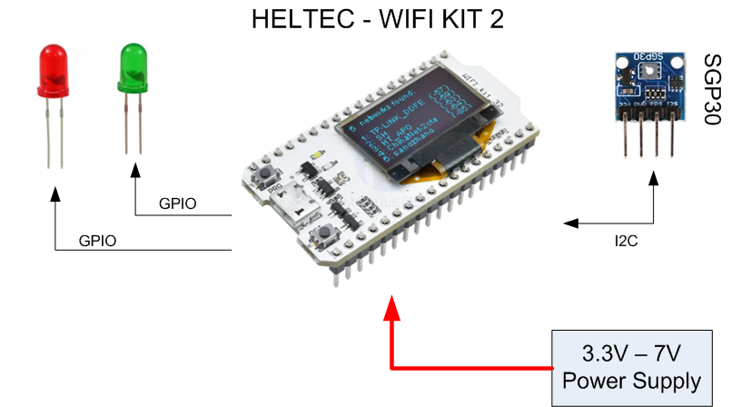
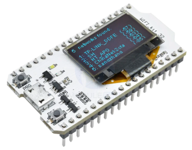
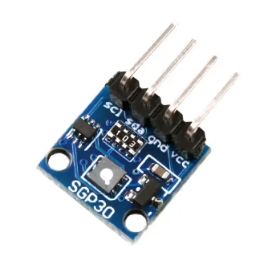
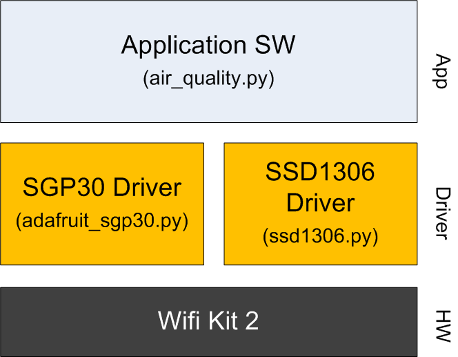
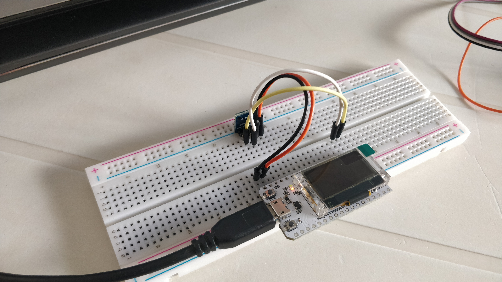
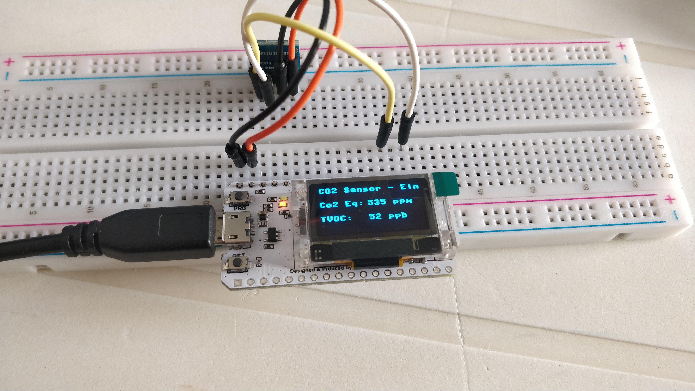

## IndoorAirQuality
Public repo for Indoor Air quality made for Elettronica In.

## What's this
The Indoor Air Quality project is a simple ESP32 based device intended for acquairing and collecting Air Quality data inside buildings like schools and offices, in order to have an indication that highlight the needs for air refresh. This is particularly useful for COVID infection prevention. The working principle is quite simple: the board can be configured with an user-defined CO2 threshold that indciated the maximum allowed CO2 concentration. Once this threshold is reached, the board will show a message on the display and turn on a red LED that indicated the need for an air refresh (e.g. open windows). Once the CO2 concentration falls back to an acceptable level, the red LED is turned off and a green one is light up (is possible to close the windows).

The concept is represented in the picture below:

## HW details
The core of the system is the WiFi kit 32, a nice development board made by Heltec and available on futurashop at the following link:
[https://futuranet.it/prodotto/modulo-esp32-con-display-oled-096/](https://futuranet.it/prodotto/modulo-esp32-con-display-oled-096/)

The board has the following characteristics:

- Display OLED blu da 0,96” 
- Microcontrollor Dual-Core Tensilica LX6 a 32 bit
- Clock up to240 MHz
- 520 kB internal SRAM
- 32 MB internal flash
- Integarted Wi-Fi 802.11 b/g/n 
- Integarted dual-mode Bluetooth  
- Power supply from 3,3 V to 7 V
- 28 GPIO 
- Integrated LiPo battery charger
- Operating temperature from -40°C to +90°C

The WiFi kit 32 is connected to the SGP30, an indoor air quality sensor from sensirion, capable of reading CO2 and TVOC concentration. Thi sensor is also available in a confortable 4-pin breakout board from futurashop at the following link: [https://futuranet.it/prodotto/breakout-con-sensore-qualita-dellaria-sgp30/](https://futuranet.it/prodotto/breakout-con-sensore-qualita-dellaria-sgp30/)

## Wiring
The wiring between the WiFi Kit 32 and the SGP30 breakout is quite simple as the sensor got an i2c interface and thus it needs just SDA and SCL to be connected, plus power and ground. Additionally you need to foresee two additional connections for green ad red LEDs.

The tables below resume the connections between the wifi kit 2 and SGP30 breakout and the pins used for LEDs:

|      Function      |      Pins      |
|--------------------|:--------------:|
| SDA                | 19             |
| SCL                | 18             |
| Ground             | GND            |
| 3,3V               | 3V3            |

|        LEDs        |      Pins      |
|--------------------|:--------------:|
| Green LED          | 2              |
| Red LED            | 17             |

## SW architecture
I've found two nice libraries to manage the peripherals:

1. **OLED driver - Adafruit**: [https://github.com/adafruit/micropython-adafruit-ssd1306](https://github.com/adafruit/micropython-adafruit-ssd1306): Now deprecated, but works quite fine. Differently from ESP8266 micripython port, the ESP32 ones seems not to have this driver in the binary image, so you have to load the file in the device's memory.
2. **SGP30 driver - Adafruit** (maintained by [Alexandre Marquet](https://github.com/alexmrqt)): [https://github.com/alexmrqt/micropython-sgp30](https://github.com/alexmrqt/micropython-sgp30). Really a nice piece of work, it works perfectly. 

These two libraries constituite the foundation of my SW architecture, represented in the picture below:

To build the application layer I got inspiration from the example found in the [Alex SGP30 repo](https://github.com/alexmrqt/micropython-sgp30/tree/master/examples).  

## Tests
I can't access the lab in this period, so I'm really bare-metal testing it. I was nevertheless able to build a small proto and it seems working fine, here are a couple of pictures:

**!!! Update !!!**: I was sick to keep my finger on the board to make the sensor's I2C working and so I purchased a cheap solder iron on Amazon and make a less-bare-metal-proto. Now it's running the calibration step (lasts 12 hours), will see :-) Here is a video anyhow:

[Indoor Air Quality Meter Youtube Video](https://www.youtube.com/watch?v=ah0WZv5Y7ic)

## Throubleshooting
Some known issues:

1. If you run the device standalone (i.e. with the application file embedded in a main.py file) you may notice that the display ain't working. I don't know why yet, but I'll investigate. A simple workaround to make it working is to press the reset button.

## Pubblications
A detailed article in italian will soon be realeased on [Elettronica In](https://www.elettronicain.it/).
